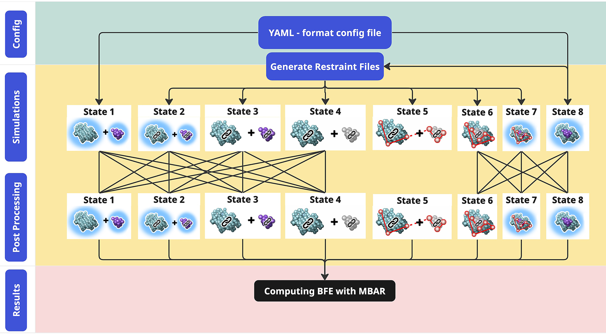

.. _ddm_cycle-label:

Implementation Details
==============================================

Conformationally restrained Alchemical-Pathway
==============================================
To connect the bound and unbound end-states, we employ double decoupling method modified to utilize implicit solvent models as implement in Amber and AmberTools.
Specifically, conformational restraints are applied to the solutes to restrict their motion.
This limits the accessible conformational space that must be sampled and avoids the need for soft-core Lennard-Jones interactions.
Following our modified DDM cycle from unbound to bound end-states: 

- State 1-2 conformational restraints are applied in a series of windows; 

- State 2-3 both ligand and receptor are decoupled from the solvent;

- State 3-4 ligand charges are set to zero;

- State 4-5 Boresch orientational restraints are applied [#boresch2003absolute] (state 5 is not simulated); 

- State 5-6 ligand and receptor are introduced in the same simulation but do not interact and there is no change in free energy;

- State 6-7 ligand charges are restored, solvent is reintroduced and LJ interactions are turned on between ligand and receptor; and

- State 7-8 orientational and conformational restraints are turned off in a series of windows.

The binding free energy is then:

.. math ::
   \Delta G_{\text{bind}}=\Delta G_{1,8}=\Delta G_{1,2}+\Delta G_{2,3}+\Delta G_{3,4}+\Delta G_{4,5}+\Delta G_{5,6}+\Delta G_{7,8}.
   :label: eq:bind

.. image:: _static/images/thermo_cycle_labeled.png
   :width: 600px
   :align: center

ISDMM.py Workflow 
*****************
ISDDM.py is a Python program that automates preparing, running and post-processing all the MD simulations for calculating the free energies.
A single configurational file is needed to run the entireISDDM.pyworkflow. 
In the simplest use case, users provide a force field parameter file and initial coordinates of the ligand and receptor in the bound state, along with an the input file of parameters for ISDDM.py.
When the program is executed, it will carry out sampling of the bound and unbound end-states, as well as MD simulations and analysis to connect them using the thermodynamic cycle.
Once the bound end-state simulation is completed, the last frame of the bound end-state trajectory is then used to construct bound and unbound restraints files consisting of Boresch orientational and conformational restraints.
These restraints are gradually applied and released to ensure favorable space phase overlap.

